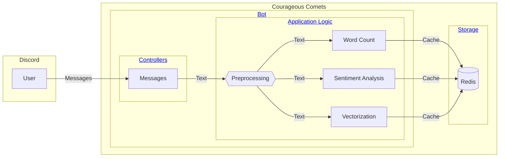

# Architecture & Design

This page describes the architecture and design of the Courageous Comets application.

## Components

Below is a high-level view of the application components. Click on the links in the diagram to jump to the
corresponding details section.

## Bot

The bot is the main component of the Courageous Comets application. It is responsible for processing messages
and performing analysis on them.

The bot is built using the [discord.py](https://discordpy.readthedocs.io/en/stable/) library. It is designed to
be modular and extensible, with the core features implemented on separate layers.

### Controllers

Controllers are responsible for handling user input and invoking the appropriate application logic. Each controller
is a separate cog in the bot, allowing for easy extension and maintenance.

### Application Logic

The application logic is responsible for processing messages and performing analysis on them. The logic is divided
into several components:

- **Preprocessing**: Cleans and normalizes the input text.
- **Word Count**: Counts the number of words in the input text.
- **Sentiment Analysis**: Analyzes the sentiment of the input text.
- **Vectorization**: Generates a vector representation to support similarity search.

## Storage

The bot uses Redis as a caching layer to store the results of the analysis. Redis is a fast and efficient key-value
store that supports the data structures needed to enable the application logic.
