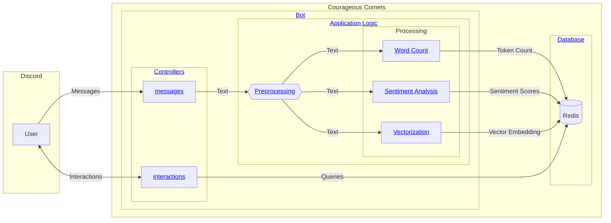
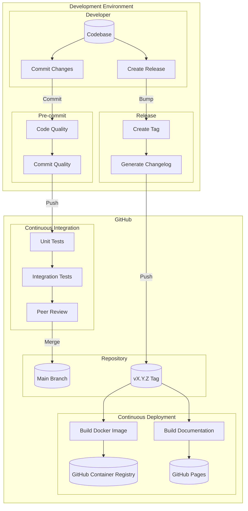

# Architecture & Design

This page describes the architecture and design of the Courageous Comets application.

## Components

Below is a high-level view of the application components. Click on the links in the diagram to jump to the
corresponding details section.

### Bot

The bot is the main component of the Courageous Comets application. It is responsible for processing messages
and performing analysis on them.

The bot is built using the [discord.py](https://discordpy.readthedocs.io/en/stable/) library. We chose this library
since it's the most mature library for building Discord bots in Python and did not expect to need any special
features provided by other libraries.

The application is designed to be modular and extensible, with the core features implemented on separate layers.

#### Controllers

Controllers are responsible for handling user input and invoking the appropriate application logic. All controllers
are implemented as Discord cogs, which are modular components that can be enabled or disabled based on the
application configuration.

##### Messages

The messages cog is highlighted in the diagram as it is the primary controller for processing messages. It listens
for messages sent by users, and passes them on for internal processing.

##### Interactions

Other cogs included with the bot are responsible for handling interactions with users, such as slash commands,
context menus, and buttons. Typically, the response to an interaction will be a UI element like an embed. Embeds
may include charts, tables, or other visualizations.

##### Design Decisions

Responses from the bot should typically be sent as ephemeral messages, meaning they are only visible to the user
who triggered the interaction. The exception to this is when an interaction is supposed to be visible to all users.

When an interaction is triggered, the bot should respond as soon as possible to acknowledge the interaction. In
case of loading times, the bot should provide a loading indicator to the user. In case of errors, useful feedback
should be provided to the user in the form of an error message.

We decided to have a dedicated cog per interaction. For example, there is a separate cog for searching for keywords
using a slash command and a separate cog for searching for keywords using a context menu item. This split makes
sure that each cog does not grow too large and remains maintainable.

#### Application Logic

The application logic is responsible for processing messages and performing analysis on them. The logic is divided
into several components:

- **Preprocessing**: Cleans and normalizes the input text.
- **Word Count**: Counts the number of words in the input text.
- **Sentiment Analysis**: Analyzes the sentiment of the input text.
- **Vectorization**: Generates a vector representation to support similarity search.

##### Preprocessing

The preprocessing step is responsible for cleaning and normalizing the input text. This includes the following
steps:

- Drop code blocks
- Drop links
- Replace special characters and diacritics with standard ASCII characters
- Expand contractions
- Drop punctuation
- Drop very long words
- Drop extra whitespace
- Truncate the text to a maximum length

Preprocessing is essential to ensure that the input text is in a consistent format before further analysis is
performed and to avoid overloading the downstream components with irrelevant information.

##### Word Count

The word count analysis counts the number of keywords in the input message. This analysis is used to generate
the most popular topics in a channel or server.

The first step in the word count analysis is to tokenize the input text. The text is split into individual words
using the NLTK library, which is a popular library for natural language processing in Python that provides a robust
tokenizer for English text out of the box.

The tokenized text is then stemmed using NLTK's Snowball Stemmer. Stemming reduces words to their root form, which
helps to group similar words together. For example, the words "running" and "runs" would both be stemmed to "run".

Next, we remove stopwords from the tokenized text. Stopwords are common words like "the", "and", and "is" that
do not carry much meaning and are typically removed from text before analysis. We also remove any words that are
single characters long, as these are unlikely to be meaningful.

Finally, the keywords are counted and the results are stored in the database.

##### Sentiment Analysis

The sentiment analysis component is responsible for analyzing the attitude of an input message. This enables the
sentiment search feature and supports the moderation features of the bot.

The sentiment analysisis performed using the NLTK library, which provides a pre-trained sentiment analysis model.
The model assigns polarity scores to the input text, which indicate the positive, negative, and neutral sentiment
of the text.

Each polarity score ranges from 0 to 1, with 0 indicating the absence of the sentiment. All three scores sum up
to 1.

The model also provides a compound score, which is a normalized combination of the positive, negative, and neutral
scores. Compound scores range from -1 (most negative) to 1 (most positive).

The polarity scores and compound score for every message are stored in the database for later retrieval and analysis.

##### Vectorization

The vectorization component is responsible for generating a vector embedding of the input text. The vector
embeddings support similarity search, which allows users to find messages with similar meaning.

Vectorization is done using the [all-MiniLM-L6-v2](https://huggingface.co/sentence-transformers/all-MiniLM-L6-v2)
transformer which maps sentences and paragraphs to a 384-dimensional dense vector space that captures the semantic
meaning of the input text.

First, a tokenizer is trained using the model and used to tokenize the text. The token embeddings are computed
using Torch and then a pooling operation is applied on top of the contextualized word embeddings.
These embeddings are then normalized to generate a single embedding for the entire text.

Finally, the embedding vector is converted to bytes and this bytes representation is stored in the database
for later retrieval and analysis.

## Database

The bot uses Redis as a database layer to store the results of the analysis. Redis is a fast and efficient key-value
store that offers search and query features needed to enable the application logic. Courageous Comets uses the
Redis Stack distribution, which includes plugins for full-text search and metric-based search.

### Design Decisions

We chose Redis over other databases like PostgreSQL or MongoDB because of its speed and simplicity.

We knew that we'd be writing messages at a high rate and needed a database that could keep up with the volume
of data. Redis only writes to memory and periodically persists to disk, making it ideal for our workload of writing
a lot of small messages quickly.

Further, we expected to need efficient full-text search capabilities and metric-based search capabilities. There
are plugins for Redis that provide these features. The Redis Stack distribution includes these plugins by default,
making it a good fit for our use case.

Additionally, we expected not to require relational queries or complex joins, which are better suited for a relational
database like PostgreSQL.

Redis is also easy to set up and configure, making it a good choice for a small-scale application like Courageous
Comets.

There is a small risk of data loss in case of a crash. The application may lose data that Redis has not yet persisted
to disk. However, we are willing to accept this risk given that missing a few messages will not affect the overall
user experience.

## Data Model

The data model is designed to support a variety of analysis tasks and provide a flexible foundation for future
extensions.

### Message

The main entity of the data model is the `Message` object, which represents a message sent by a user. Messages
are structured as follows:

| Name                 | Data Type | Index Type | Description                                                                                  |
| -------------------- | --------- | ---------- | -------------------------------------------------------------------------------------------- |
| `user_id`            | `string`  | `Tag`      | The discord ID of the user who sent the message.                                             |
| `message_id`         | `string`  | `Tag`      | The discord message ID.                                                                      |
| `channel_id`         | `string`  | `Tag`      | The ID of the discord channel where the message was sent.                                    |
| `guild_id`           | `string`  | `Tag`      | The ID of the guild where the message was sent.                                              |
| `timestamp`          | `float`   | `Numeric`  | The UNIX timestamp of when the message was sent.                                             |
| `sentiment_neg`      | `float`   | `Numeric`  | The negative score of the sentiment analysis of the message.                                 |
| `sentiment_pos`      | `float`   | `Numeric`  | The positive score of the sentiment analysis of the message.                                 |
| `sentiment_neu`      | `float`   | `Numeric`  | The neutral score of the sentiment analysis of the message.                                  |
| `sentiment_compound` | `float`   | `Numeric`  | The compound score of the sentiment analysis of the message.                                 |
| `embedding`          | `bytes`   | `Vector`   | The embedding vector of the message content                                                  |
| `tokens`             | `string`  | N/A        | JSON object mapping each token in the message to number of times it appeared in the message. |

### Design Decisions

While the fields ending with `_id` are integers on Discord, they are stored as strings on Redis and indexed as
[Tags](https://redis.io/docs/latest/develop/interact/search-and-query/advanced-concepts/tags/) rather than
[Numeric](https://redis.io/docs/latest/develop/interact/search-and-query/basic-constructs/field-and-type-options/#numeric-fields)
because we want to make exact-match queries against these fields. Also, `Tags` are more memory-efficient and
faster to query.

Rather than store the message as a JSON document with the sentiment-related values stored in a nested mapping,
they are stored on the same hash with a prefix of `sentiment_`. This is because JSON documents generally have
a larger memory footprint compared to the hash when searching over documents. Also, JSON documents take up more
space than the hash. For context, the JSON document representation of the message takes at least 14Kb while the
hash takes at most 4Kb.

The [Cosine Similarity](https://en.wikipedia.org/wiki/Cosine_similarity) was chosen over the Euclidean distance
and Internal product as the distance metric for searching the vector embedding because we want to consider the
angle formed by two vectors (messages) and not their magnitude.

The dimensions of the vector were chosen to match the dimension of the embedding generated by the [all-MiniLM-L6-v2](https://huggingface.co/sentence-transformers/all-MiniLM-L6-v2)
transformer. Ensure to set the correct dimension as the transformer model being used during index creation on Redis.

The `tokens` field on the hash was not indexed as there was no need to search over it. Including it in the index
would increase the size of the index structure and add unnecessary overhead. However, we can still return it from
search-based queries.

## Packages & Modules

This section describes the packages included with the project and the underlying module structure.

### `courageous_comets`

The application is fully contained within the `courageous_comets` package. The package is structured as follows:

| Module             | Description                                                                              |
| ------------------ | ---------------------------------------------------------------------------------------- |
| `cogs`             | Provides the bot controllers (cogs) that handle user input.                              |
| `discord`          | Implements functions for interacting with the Discord API.                               |
| `nltk`             | Contains helpers for using the Natural Language Toolkit (NLTK) library.                  |
| `redis`            | Provides the data access layer for interacting with Redis.                               |
| `transformers`     | Contains helpers for working with Huggingface Transformers.                              |
| `ui`               | Includes all UI elements for the bot (`charts`, `components`, `embeds`, and `views`).    |
| `client.py`        | Contains the main application client class.                                              |
| `__init__.py`      | Entrypoint for the package. Exports the application client instance.                     |
| `__main__.py`      | Entrypoint for the application. Responsible for setup, teardown and root error handling. |
| `enums.py`         | Shared enumerations used across the application.                                         |
| `exceptions.py`    | Includes the base exception class and custom exceptions used in the application.         |
| `models.py`        | Defines the entities used by the application using `pydantic` models.                    |
| `preprocessing.py` | Contains the preprocessing logic for cleaning and normalizing text.                      |
| `processing.py`    | Implements the main processing logic for analyzing messages.                             |
| `sentiment.py`     | Implements the sentiment analysis logic using the NLTK library.                          |
| `settings.py`      | Provides input validation, default values and type hints for the app settings.           |
| `utils.py`         | Contains utility functions used across the application.                                  |
| `vectorizer.py`    | Implements the vectorization logic using the Huggingface Transformers library.           |
| `words.py`         | Contains the word count logic for counting the number of words in a text.                |

### `tests`

The `tests` package organizes the test suite for the application. The package is structured as follows:

| Module              | Description                                                                       |
| ------------------- | --------------------------------------------------------------------------------- |
| `conftest.py`       | Contains shared fixtures and ensures NLTK and Huggingface data is loaded in CI.   |
| `courageous_comets` | Includes tests that validate the behavior of each application module.             |
| `integrations`      | Provides tests that validate how the app interacts with Discord and the database. |

## CI/CD Pipeline

The CI/CD (Continuous Integration and Continuous Deployment) pipeline automates the build, test, and deployment
processes of the application. This achieves the following goals:

1. The process ensures that code changes are consistently tested, maintaining high code quality and reliability
2. It also enables full traceability and reproducibility of any
   artifact released to production.

This section provides a comprehensive overview of each stage in the pipeline, its purpose, and its components.

### Overview

The diagram below illustrates the stages of the CI/CD pipeline and the flow of code changes from development to
deployment. The pipeline consists of the [development flow](#development-flow) and the release flow.

### Development Flow

In the development flow, developers are responsible for making changes to the codebase and committing these changes
to the repository. When changes are ready, developers commit these changes, triggering the pre-commit checks.

#### Pre-commit

The pre-commit checks involve several steps to ensure that the codebase and the repository stay in a maintainable
state. These steps are executed locally using the [`pre-commit`](https://pre-commit.com/) framework and block
the commit if any of the checks fail.

##### Code Quality

First, the code is formatted and linted using [`ruff`](https://docs.astral.sh/ruff/). Next, the code is type-checked
using [`pyright`](https://github.com/microsoft/pyright). Markdown is also treated as code for this project, so
it is linted using [`markdownlint`](https://github.com/DavidAnson/markdownlint).

##### Commit Quality

Since commit messages are a key input to the release process, they validated using [`commitizen`](https://commitizen-tools.github.io/commitizen/).
Commitizen enforces a consistent commit message format and ensures that the messages follow the [Conventional Commits](https://www.conventionalcommits.org/en/v1.0.0/)
specification.

#### Continuous Integration

Once changes are pushed to the repository, the continuous integration process starts. In this stage, a series
of tests are run to ensure the new code works as expected and does not introduce regressions.

Unit tests are in place to validate the behavior of individual components, while integration tests validate the
interaction between components. We use the [`pytest`](https://docs.pytest.org/) framework to run the tests.

All [pre-commit](#pre-commit) checks are also run in the CI pipeline to avoid any discrepancies between the local
and remote environments.

When all tests and checks pass, there is a final peer review before the changes are merged into the main branch.

### Release Flow

The release flow is triggered when a developer bumps the version of the application and creates a new release.

#### Release

The first part of the release flow involves determining the version number for the new release. This is done using
[`Commitizen`](https://commitizen-tools.github.io/commitizen/), which automatically increments the version based
on the commit messages. Version numbers follow the [Semantic Versioning](https://semver.org/) specification.

Secondly, a changelog is generated using [`commitizen`](https://commitizen-tools.github.io/commitizen/). The changelog
provides a summary of the changes included in the release, making it easier for users to understand what has been
updated.

The new changelog is committed to the repository, and the version tag is created. This tag is used to trigger the
continuous deployment process.

#### Continuous Deployment

The continuous deployment process involves building the Docker image for the application and pushing it to the
[GitHub Container Registry](https://github.com/features/packages) (GHCR). The Docker image is versioned
on the release tag.

Additionally, the documentation is built using [MkDocs](https://www.mkdocs.org/) and publishedb to GitHub Pages.
The documentation is also tagged with the release version using [mike](https://github.com/jimporter/mike). This
way, users can access the documentation corresponding to the version of the app they are using.
