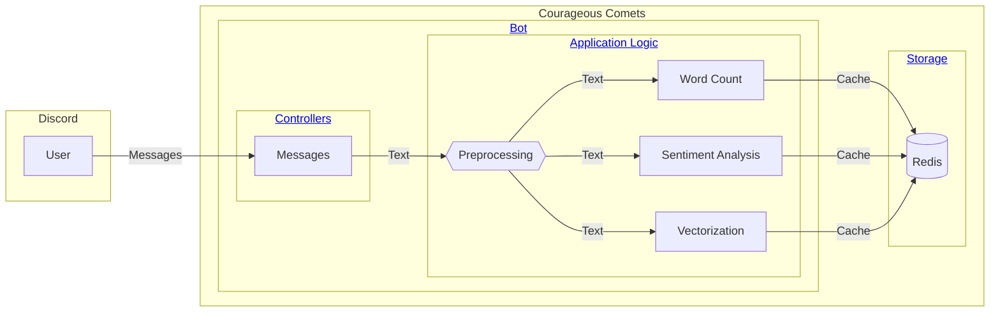

# Architecture & Design

This page describes the architecture and design of the Courageous Comets application.

## Components

Below is a high-level view of the application components. Click on the links in the diagram to jump to the
corresponding details section.

### Bot

The bot is the main component of the Courageous Comets application. It is responsible for processing messages
and performing analysis on them.

The bot is built using the [discord.py](https://discordpy.readthedocs.io/en/stable/) library. It is designed to
be modular and extensible, with the core features implemented on separate layers.

#### Controllers

Controllers are responsible for handling user input and invoking the appropriate application logic. Each controller
is a separate cog in the bot, allowing for easy extension and maintenance.

#### Application Logic

The application logic is responsible for processing messages and performing analysis on them. The logic is divided
into several components:

- **Preprocessing**: Cleans and normalizes the input text.
- **Word Count**: Counts the number of words in the input text.
- **Sentiment Analysis**: Analyzes the sentiment of the input text.
- **Vectorization**: Generates a vector representation to support similarity search.

### Storage

The bot uses Redis as a caching layer to store the results of the analysis. Redis is a fast and efficient key-value
store that supports the data structures needed to enable the application logic.

## Data Model

The data model is designed to support a variety of analysis tasks and provide a flexible foundation for future
extensions.

### Message

The main entity of the data model is the `Message` object, which represents a message sent by a user. Messages
are structured as follows:

| Field                | Type   | Description                                                      |
| -------------------- | ------ | ---------------------------------------------------------------- |
| `message_id`         | Tag    | The unique identifier of the message.                            |
| `user_id`            | Tag    | The unique identifier of the user who sent the message.          |
| `channel_id`         | Tag    | The unique identifier of the channel where the message was sent. |
| `guild_id`           | Tag    | The unique identifier of the guild where the message was sent.   |
| `content`            | String | The text content of the message after preprocessing.             |
| `timestamp`          | Number | The timestamp when the message was sent.                         |
| `sentiment_neg`      | Number | The negative sentiment score of the message.                     |
| `sentiment_neu`      | Number | The neutral sentiment score of the message.                      |
| `sentiment_pos`      | Number | The positive sentiment score of the message.                     |
| `sentiment_compound` | Number | The compound sentiment score of the message.                     |
| `embedding`          | Vector | The vector representation of the message.                        |

Messages are keyed by a namespace prefix combined with the `guild_id` and the `message_id`. This combination ensures
that messages can always be uniquely identified within the context of a guild.

The fields with type `Tag` can be efficiently used for keyword search and filtering. This way we can quickly retrieve,
filter and aggregate messages based on the context of an interaction, such as a user, channel, or guild.

The `embedding` field is used to store the vector representation of the message. This field is used for
similarity search and other analysis tasks that require a numerical representation of the text. For the similarity
search, we use the [cosine similarity](https://en.wikipedia.org/wiki/Cosine_similarity) metric to compare the vectors.
