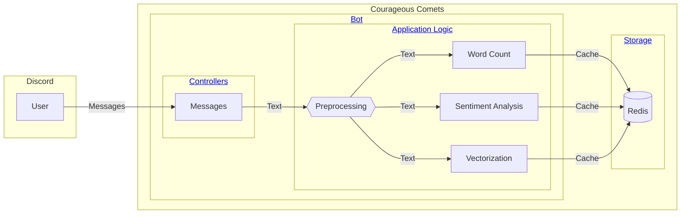
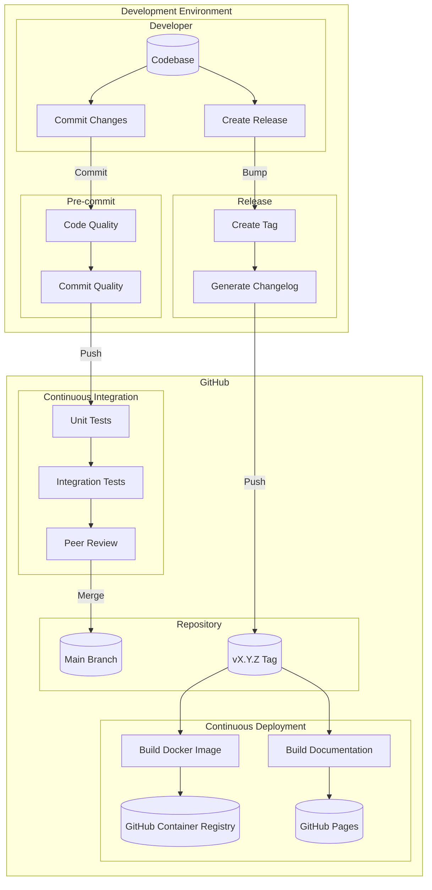

# Architecture & Design

This page describes the architecture and design of the Courageous Comets application.

## Components

Below is a high-level view of the application components. Click on the links in the diagram to jump to the
corresponding details section.

### Bot

The bot is the main component of the Courageous Comets application. It is responsible for processing messages
and performing analysis on them.

The bot is built using the [discord.py](https://discordpy.readthedocs.io/en/stable/) library. It is designed to
be modular and extensible, with the core features implemented on separate layers.

#### Controllers

Controllers are responsible for handling user input and invoking the appropriate application logic. Each controller
is a separate cog in the bot, allowing for easy extension and maintenance.

#### Application Logic

The application logic is responsible for processing messages and performing analysis on them. The logic is divided
into several components:

- **Preprocessing**: Cleans and normalizes the input text.
- **Word Count**: Counts the number of words in the input text.
- **Sentiment Analysis**: Analyzes the sentiment of the input text.
- **Vectorization**: Generates a vector representation to support similarity search.

### Storage

The bot uses Redis as a database layer to store the results of the analysis. Redis is a fast and efficient key-value
store that offers search and query features needed to enable the application logic.

## Data Model

The data model is designed to support a variety of analysis tasks and provide a flexible foundation for future
extensions.

### Message

The main entity of the data model is the `Message` object, which represents a message sent by a user. Messages
are structured as follows:

| Field                | Type   | Description                                                      |
| -------------------- | ------ | ---------------------------------------------------------------- |
| `message_id`         | Tag    | The unique identifier of the message.                            |
| `user_id`            | Tag    | The unique identifier of the user who sent the message.          |
| `channel_id`         | Tag    | The unique identifier of the channel where the message was sent. |
| `guild_id`           | Tag    | The unique identifier of the guild where the message was sent.   |
| `content`            | String | The text content of the message after preprocessing.             |
| `timestamp`          | Number | The timestamp when the message was sent.                         |
| `sentiment_neg`      | Number | The negative sentiment score of the message.                     |
| `sentiment_neu`      | Number | The neutral sentiment score of the message.                      |
| `sentiment_pos`      | Number | The positive sentiment score of the message.                     |
| `sentiment_compound` | Number | The compound sentiment score of the message.                     |
| `embedding`          | Vector | The vector representation of the message.                        |

Messages are keyed by a namespace prefix combined with the `guild_id` and the `message_id`. This combination ensures
that messages can always be uniquely identified within the context of a guild.

The fields with type `Tag` can be efficiently used for keyword search and filtering. This way we can quickly retrieve,
filter and aggregate messages based on the context of an interaction, such as a user, channel, or guild.

The `embedding` field is used to store the vector representation of the message. This field is used for
similarity search and other analysis tasks that require a numerical representation of the text. For the similarity
search, we use the [cosine similarity](https://en.wikipedia.org/wiki/Cosine_similarity) metric to compare the vectors.

## Packages & Modules

This section describes the packages included with the project and the underlying module structure.

### `courageous_comets`

The application is fully contained within the `courageous_comets` package. The package is structured as follows:

| Module             | Description                                                                              |
| ------------------ | -----------------------------------------------------------------------------------------|
| `cogs`             | Contains the bot controllers (cogs) that handle user input.                              |
| `nltk`             | Contains helpers for using the Natural Language Toolkit (NLTK) library.                  |
| `redis`            | Contains the data access layer for interacting with Redis.                               |
| `transformers`     | Contains helpers for working with Huggingface Transformers.                              |
| `client.py`        | Contains the main application client class.                                              |
| `__init__.py`      | Entrypoint for the package. Exports the application client instance.                     |
| `__main__.py`      | Entrypoint for the application. Responsible for setup, teardown and root error handling. |
| `enums.py`         | Shared enumerations used across the application.                                         |
| `exceptions.py`    | Includes the base exception class and custom exceptions used in the application.          |
| `models.py`        | Defines the entities used by the application using Pydantic models.                      |
| `preprocessing.py` | Contains the preprocessing logic for cleaning and normalizing text.                      |
| `sentiment.py`     | Implements the sentiment analysis logic using the NLTK library.                          |
| `settings.py`      | Provides input validation, default values and type hints for the app settings.           |
| `vectorizer.py`    | Implements the vectorization logic using the Huggingface Transformers library.           |
| `words.py`         | Contains the word count logic for counting the number of words in a text.                |

### `tests`

The `tests` package organizes the test suite for the application. The package is structured as follows:

| Module              | Description                                                                       |
| ------------------- | ----------------------------------------------------------------------------------|
| `conftest.py`       | Contains shared fixtures and ensures NLTK and Huggingface data is loaded in CI.   |
| `courageous_comets` | Includes tests that validate the behavior of each application module.             |
| `integrations`      | Provides tests that validate how the app interacts with Discord and the database. |

## CI/CD Pipeline

The CI/CD (Continuous Integration and Continuous Deployment) pipeline automates the build, test, and deployment
processes of the application. This achieves the following goals:

1. The process ensures that code changes are consistently tested, maintaining high code quality and reliability
2. It also enables full traceability and reproducibility of any
artifact released to production.

This section provides a comprehensive overview of each stage in the pipeline, its purpose, and its components.

### Overview

The diagram below illustrates the stages of the CI/CD pipeline and the flow of code changes from development to
deployment. The pipeline consists of the [development flow](#development-flow) and the release flow.

### Development Flow

In the development flow, developers are responsible for making changes to the codebase and committing these changes
to the repository. When changes are ready, developers commit these changes, triggering the pre-commit checks.

#### Pre-commit

The pre-commit checks involve several steps to ensure that the codebase and the repository stay in a maintainable
state. These steps are executed locally using the [`pre-commit`](https://pre-commit.com/) framework and block
the commit if any of the checks fail.

##### Code Quality

First, the code is formatted and linted using [`ruff`](https://docs.astral.sh/ruff/). Next, the code is type-checked
using [`pyright`](https://github.com/microsoft/pyright). Markdown is also treated as code for this project, so
it is linted using [`markdownlint`](https://github.com/DavidAnson/markdownlint).

##### Commit Quality

Since commit messages are a key input to the release process, they validated using [`commitizen`](https://commitizen-tools.github.io/commitizen/).
Commitizen enforces a consistent commit message format and ensures that the messages follow the [Conventional Commits](https://www.conventionalcommits.org/en/v1.0.0/)
specification.

#### Continuous Integration

Once changes are pushed to the repository, the continuous integration process starts. In this stage, a series
of tests are run to ensure the new code works as expected and does not introduce regressions.

Unit tests are in place to validate the behavior of individual components, while integration tests validate the
interaction between components. We use the [`pytest`](https://docs.pytest.org/) framework to run the tests.

All [pre-commit](#pre-commit) checks are also run in the CI pipeline to avoid any discrepancies between the local
and remote environments.

When all tests and checks pass, there is a final peer review before the changes are merged into the main branch.

### Release Flow

The release flow is triggered when a developer bumps the version of the application and creates a new release.

#### Release

The first part of the release flow involves determining the version number for the new release. This is done using
[`Commitizen`](https://commitizen-tools.github.io/commitizen/), which automatically increments the version based
on the commit messages. Version numbers follow the [Semantic Versioning](https://semver.org/) specification.

Secondly, a changelog is generated using [`commitizen`](https://commitizen-tools.github.io/commitizen/). The changelog
provides a summary of the changes included in the release, making it easier for users to understand what has been
updated.

The new changelog is committed to the repository, and the version tag is created. This tag is used to trigger the
continuous deployment process.

#### Continuous Deployment

The continuous deployment process involves building the Docker image for the application and pushing it to the
[GitHub Container Registry](https://github.com/features/packages) (GHCR). The Docker image is versioned
on the release tag.

Additionally, the documentation is built using [MkDocs](https://www.mkdocs.org/) and publishedb to GitHub Pages.
The documentation is also tagged with the release version using [mike](https://github.com/jimporter/mike). This
way, users can access the documentation corresponding to the version of the app they are using.
