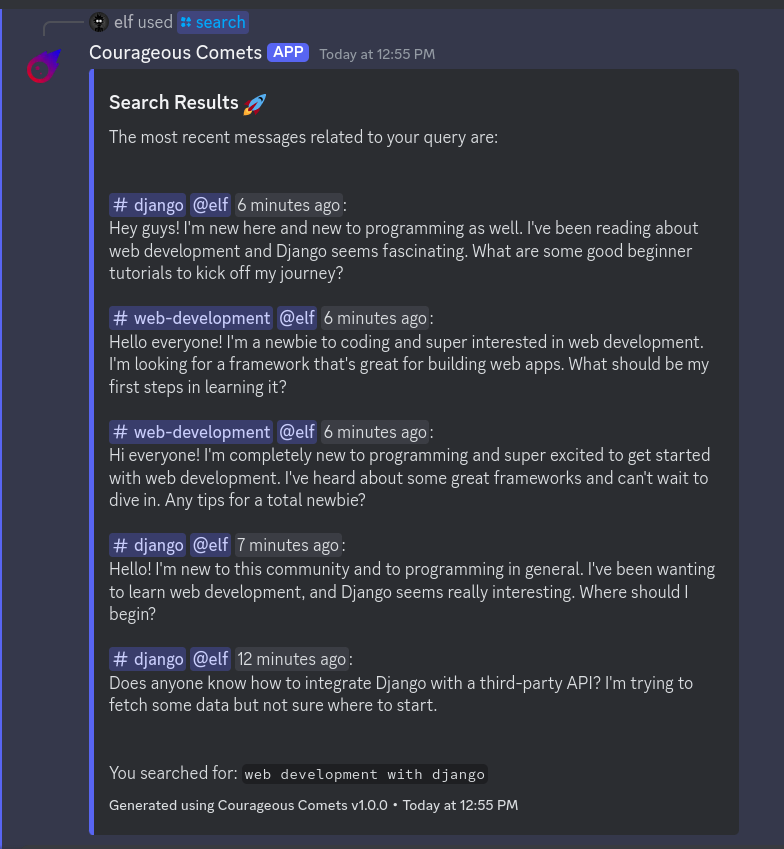
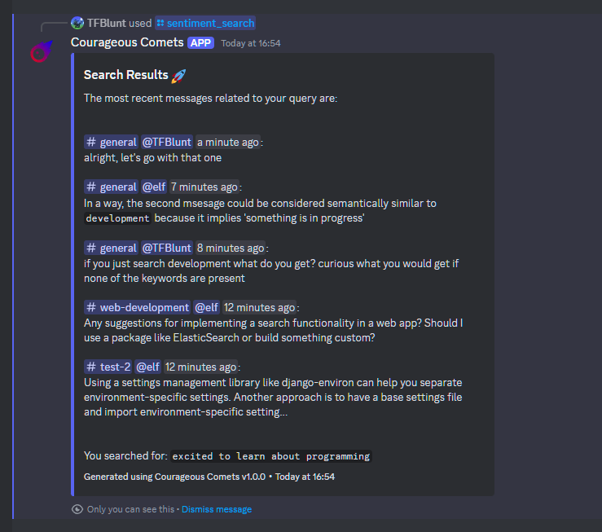
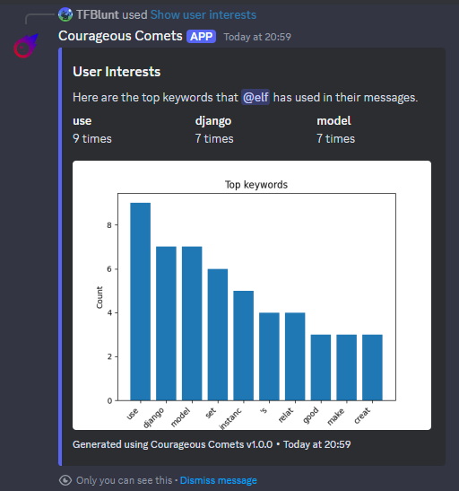
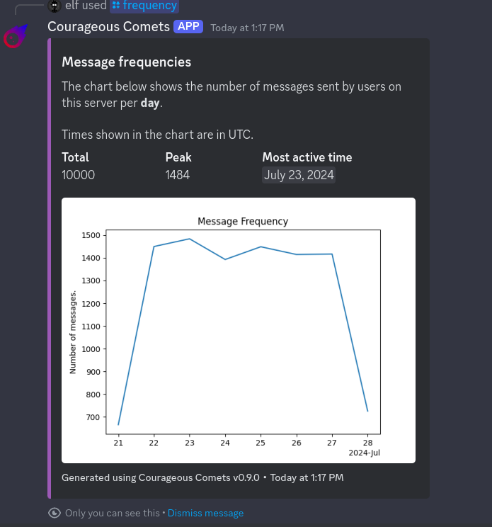
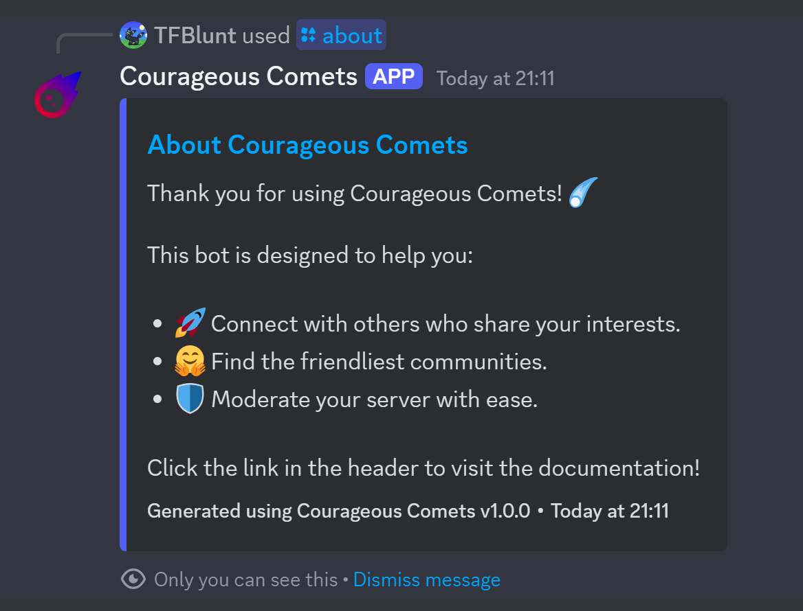

# Getting Started

Joining a new Discord server can sometimes feel overwhelming. With Courageous Comets, you can quickly get a sense
of what a server is all about and decide if it's the right place for you.

Whether you're exploring a new community or trying to find where you fit in, Courageous Comets makes it easy.

The following sections will walk you through common interactions with the bot. For a complete list of available
interactions, refer to the [Interactions Overview](#interactions-overview) at the end of this guide.

## Finding Your Way Around

Let's say you've just joined a new server and you are interested in web development with Django. We'll use the
search feature to find the most recent messages related to those topics.

Type the following command in any channel:

```plaintext
/search query:"web development with Django"
```

The bot will return a list of messages that are relevant to your query. The search results include references to
the channels and message authors, so you can get an idea of where the conversation is happening.

<figure markdown="span" style="max-width: 500px;">
    [](../assets/user-guide/semantics-search.png)
    <figcaption>Search Results</figcaption>
</figure>

The search feature is also available as a context menu option when you right-click on a message. Use this when
you see an interesting message and want to find more like it.

## Discovering Like-Minded People

If you're looking for a new community to join, you can ask the bot to find channels and users that share your mindset.
Let's say you're excited to learn more about programming and are looking for people who feel the same way.

Try the following command:

```plaintext
/sentiment_search query:"excited to learn about programming"
```

The bot will return a list of messages that share your sentiment. Again, the results include the channels and authors
of the messages to help you explore further.

<figure markdown="span" style="max-width: 500px;">
    [](../assets/user-guide/sentiment-search.png)
    <figcaption>Sentiment Search Results</figcaption>
</figure>

The sentiment search feature is also available as a context menu option when you right-click on a message.
Use this when you find a message that resonates with you and want to find more like it.

## Getting to Know the Community

Once you've found a community you're interested in, you might want to learn more about the people who are active
there.

### Popular Topics

You can use the `topics` interaction to see a summary of what's being discussed on a server, channel, or
by a specific user.

For example, to see the most popular topics in the Python Discord server, type:

```plaintext
/topics scope:GUILD
```

The bot will return an overview of the most popular topics in the server.

<figure markdown="span" style="max-width: 500px;">
    [](../assets/user-guide/topics.png)
    <figcaption>Popular Topics</figcaption>
</figure>

You can also use the `Show user interests` context menu option to see what a particular user likes to talk about.

### Most Active Times

If you're curious about when the server is most active, you can use the `frequency` interaction to see a graph
of message frequency over a given time period.

For example, to see the daily message frequency for the last 7 days, type:

```plaintext
/frequency duration:DAILY
```

<figure markdown="span" style="max-width: 500px;">
    [](../assets/user-guide/frequency.png)
    <figcaption>Most Active Times</figcaption>
</figure>

Alternatively you can specify `HOURLY` to get the hourly message frequency for the last 24 hours, or `MINUTE`
for the last 60 minutes.

## Contributing to a Safe Environment

What's better than finding a server that aligns with your interests? When that server is filled
with friendly and welcoming people!

Courageous Comets helps moderators maintain a positive and safe environment in their servers. Use the bot to identify
the most helpful members of the community, or to detect toxic behavior and spam.

Right-click on any user or message and use the sentiment analysis interaction to get an overview of their attitude.

<figure markdown="span" style="max-width: 500px;">
    [](../assets/user-guide/user-sentiment.png)
    <figcaption>User Sentiment</figcaption>
</figure>

If a user's attitude is consistently positive, the bot provides a mechanism to praise them for their contributions.
When you praise a user, the bot will send them a message to let them know they're appreciated!

<figure markdown="span" style="max-width: 500px;">
    [](../assets/user-guide/praise.png)
    <figcaption>Praise Message</figcaption>
</figure>

Likewise, if the sentiment analysis indicates negative or toxic behavior, this can be addressed by the moderation
team.

## About the Bot

If you ever need a quick overview of the bot and its features, you can use the `about` interaction.

```plaintext
/about
```

The bot will provide a brief description of its capabilities and how to use them. The message also includes a link
to this documentation for more detailed information!

<figure markdown="span" style="max-width: 500px;">
    [](../assets/user-guide/about.png)
    <figcaption>About the Bot</figcaption>
</figure>

## Interactions overview

The table below lists all available interactions and in which context they can be used.

| Interaction        | Description                                                       | Available As                         |
| ------------------ | ----------------------------------------------------------------- | ------------------------------------ |
| Search             | Find channels, users messages that match your interests.          | `/search`, Message context           |
| Popular Topics     | Show the most popular topics for a given server, channel or user. | `/topics`, User context              |
| Sentiment Search   | Find channels, users and messages with similar attitudes.         | `/sentiment_search`, Message context |
| Sentiment Analysis | Analyze the overall attitude of a message or a user.              | User context, Message context        |
| Frequency          | Show the message frequency on a server over a given time period.  | `/frequency`                         |
| About              | Get a brief overview of the bot and its features.                 | `/about`                             |
| Ping               | Check if the bot is online and responsive.                        | `/ping`                              |
